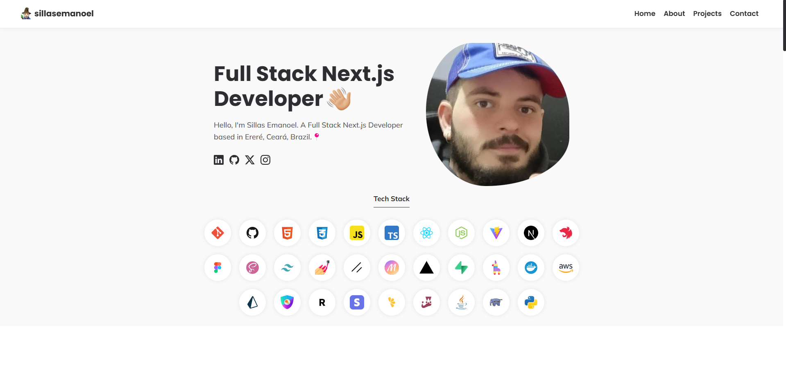

# Portfolio Sillas Emanoel (React)



Acompanhe as últimas atualizações do meu portfólio diretamente no meu site!

Este portfólio é uma aplicação desenvolvida com React e Vite, que exibe meus projetos, habilidades e informações de contato.

## Iniciando o projeto

```bash
# Clonar aplicação
$ git clone https://github.com/sillasemanoel/portfolio-sillasemanoel.git

# Acessar a aplicação
$ cd portfolio-sillasemanoel

# Execute npm para instalar as dependências
$ npm install

# Para iniciar a aplicação
$ npm run dev
```

## Ferramentas

- React
- Styled-components
- React Icons
- Vite
- TypeScript

## Aprendizados importantes

- Conceitos de Estado e Imutabilidade de estado no React
- Propriedades e componentização
- Estilização com Styled-components
- Configuração de projetos com Vite
- Navegação com React Router DOM
- Consumo de APIs com Axios
- Boas práticas de desenvolvimento com TypeScript

## Funcionalidades

- Visualizar lista de projetos
- Visualizar detalhes de um projeto
- Filtrar projetos por categoria
- Visualizar habilidades
- Entrar em contato através do formulário de contato